#Herencia y Objetos incrustados
###Alberto Álvarez y Sol González

---

## **Tipos de herencia:**
* ###Estrategia *SINGLE_TABLE*:
#####Implementa una única tabla para almacenar todos los miembros del personal.
Al implementar esta estrategia se generan las siguientes tablas:

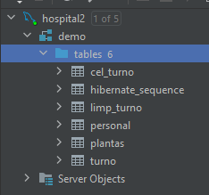

De esta forma, podemos encontrar el celador (tipo 1) y limpiador (tipo 2) que hemos
definido por código dentro de la tabla __*personal*__:

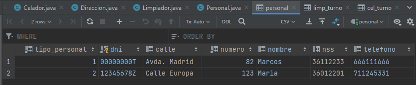

* ###Estrategia *TABLE_PER_CLASS*:
#####Implementa una tabla para cada entidad, siendo ambas tablas totalmente independientes.
Al implementar esta estrategia se generan las siguientes tablas:

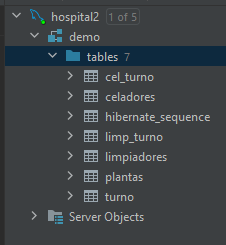

De esta forma, podemos encontrar una tabla __*celadores*__ y una tabla __*limpiadores*__ guardando
cada una sus atributos heredados de la clase personal sin que dicha tabla exista:

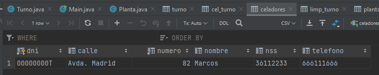  
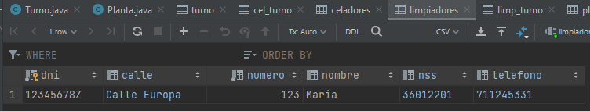

* ###Estrategia *JOINED*:
#####Implementa una tabla con los datos comunes que heredan de su clase madre y tablas para los datos específicos de cada clase.

Al implementar esta estrategia se generan las siguientes tablas:

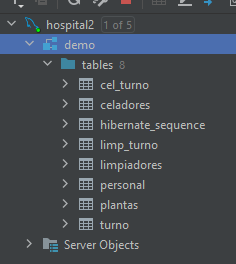

De esta forma, podemos encontrar una tabla __*personal*__ que almacena los atributos comunes de limpiadores
y celadores, pero también dos tablas, __*celadores*__ y __*limpiadores*__, con los atributos específicos
de los mismos. En este suceso no se trata de una estrategia muy lógica, como veremos en la conclusión:

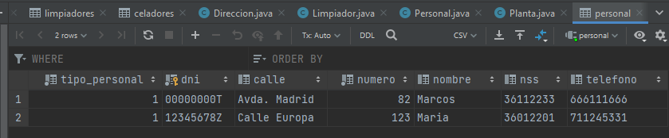  
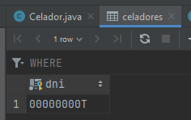
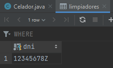

---

## **Elementos comunes en los distintos ejemplos:**

Como habrá podido apreciarse, hay una serie de tablas pertencientes al caso de prueba que
no se han visto modificadas por los distintos casos de herencia. Son las siguientes:
* Tabla __*plantas*__:  
  Con su atributo número (piso), que sería también su clave primaria.  
  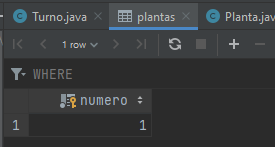
* Tabla __*turnos*__:  
  Con atributos de fecha para las horas de inicio y fin, su clave primaria generalda
  secuencialmente y la clave foránea de la planta a la que pertenece:  
  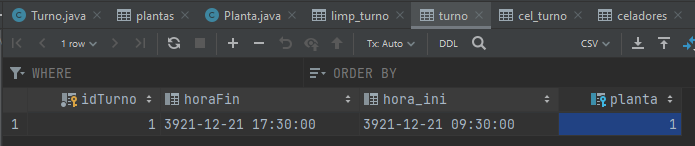
* Tablas de relación __*cel_turno*__ y __*limp_turno*__:  
  Al plantear las tablas de unión de los diferentes miembros del personal con sus turnos
  decidimos que era buena idea guardar por separado los turnos de los celadores y los limpiadores.  
  Fruto de dichas relaciones surgen las tablas cel_turno y limp_turno, uniendo las clases en cuestión:  
  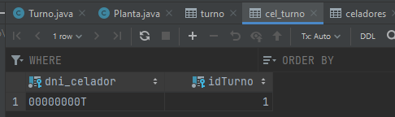  
  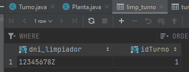

---

##**Conclusión:**
Tras probar las tres opciones podemos apreciar las ventajas e
inconvenientes que ofrece cada una.

En este caso en concreto, debido a nuestro planteamiento, las clases celador y limpiador
son en realidad idénticas. El único atributo propio que los diferencia de su clase madre
es el de su relación con la clase turno, que al ser ManyToMany, genera una tabla propia.

Es por esto que consideramos que la mejor opción sería utilizar la estrategia __*SINGLE_TABLE*__,
pues nos permite almacenar los datos de ambas clases en la misma tabla que, al ser este el suceso,
ni siquiera contendrá columnas nulas.

De contar las clases con varios atributos propios consideraríamos __*TABLE_PER_CLASS*__ la mejor
opción por permitirnos trabajar con ambas por separado.

La estrategia con menos sentido para este suceso, como ha podido apreciarse al aplicarla, sería
__*JOINED*__, dado que se traduce en la creación de dos tablas extras sin ninguna utilidad, al
contener solamente la clave primaria del celador o limpiador.